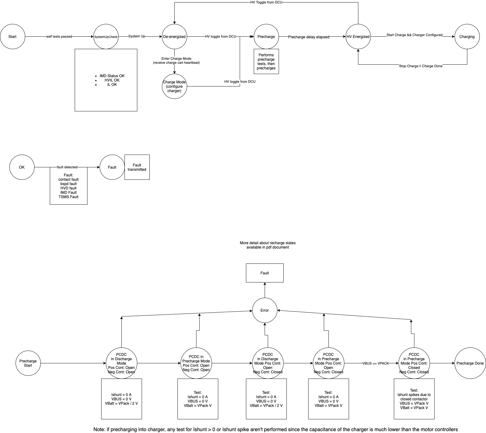

=============
State Machine
=============

Like the other boards on the car, the BMU uses a state machine to control its
high level logic. This is accomplished using the state machine driver
documented in common-all (TODO).

State Machine Diagram
---------------------

It's much easier to see if you click on the image to open it in a new page.

States
------

The following states are defined for the BMU:

.. doxygenenum:: BMU_States_t

Events
------

.. doxygenenum:: BMU_Events_t

.. doxygenvariable:: transitions

